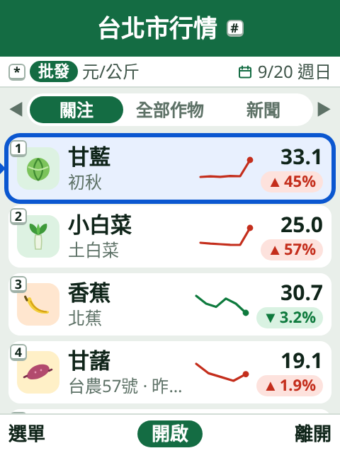
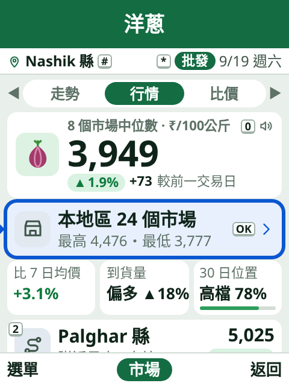
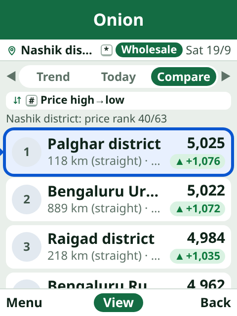
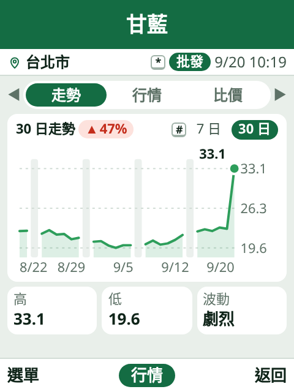
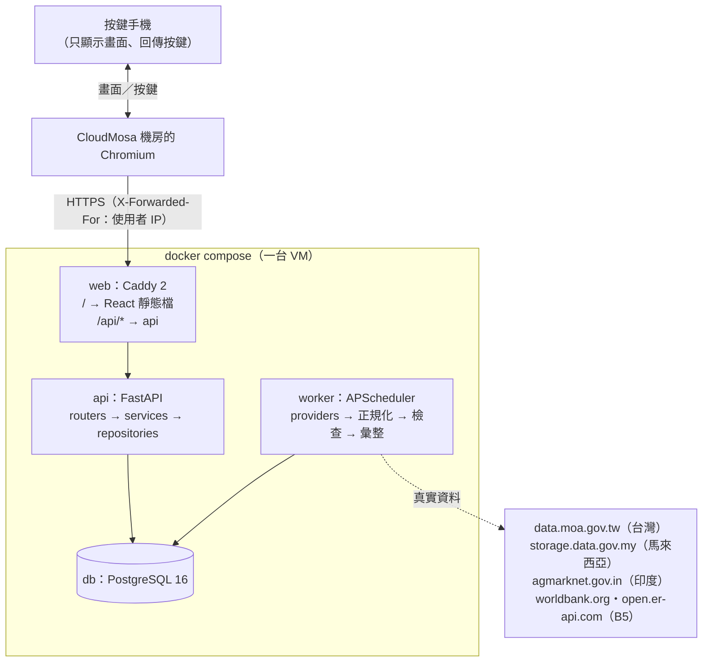

# 農價 AgriPrice

**按鍵型手機上的農產品行情 App。** 農夫與商販在 CloudMosa Cloud Phone（240×320 按鍵機）上按幾個鍵，就能看到自己地區今天的農產品價格、近期走勢，以及同一個國家各地區的價格比較。

2026 梅竹黑客松 CloudMosa 組・第 3 題「農產品即時價格」。

| 首頁（台灣・繁中） | 行情（印度・繁中） | 比價（印度・English） | 走勢 30 日（台灣） |
|---|---|---|---|
|  |  |  |  |

- **只用按鍵**：方向鍵、OK、左右軟鍵、`0`–`9`、`*`、`#` 就能走完所有畫面；每個按鍵提示就畫在它控制的東西旁邊。
- **以地區為單位**：地區批發價＝該地區當天有報價的各市場代表價中位數，並標出市場數；零售價另外切換（`*`）。
- **誠實**：缺資料就顯示「—」和原因，不是今天的資料一定標出「昨天」「3 天前」；所有日期由後端依國家時區計算。
- **三國都是官方真實資料**（不需要金鑰，評審可以當場核對）：台灣農業部果菜批發行情、印度 Agmarknet 的 mandi 行情、馬來西亞 KPDN PriceCatcher 的濕巴剎零售價。涵蓋範圍與抽查結果見下面的「資料來源」。
- **三國四語**：印度（盧比）、台灣（新台幣）與馬來西亞（令吉），介面有繁體中文、English、Bahasa Melayu 與 हिन्दी（後兩者是機器翻譯，待母語者檢查）；「More・其他」裡的其他語言暫時以英文顯示。
- **推估另一種價格**：每個官方來源只報一種價格（台灣、印度是批發，馬來西亞是零售）。缺的那一種由另一種乘上依作物類別定的倍率推估，畫面一律標成「≈零售」並說明由什麼推估、倍率多少；推估值不進 `quotes`、不覆蓋真實資料、不冒充官方數字（[docs/06 §3.6](docs/06-data.md)）。
- **附近最高／最低**：同一個國家內直線 150 km 以內、交易日相同的地區裡，價格最高與最低的兩個，直接按數字鍵就能跳過去看。
- **各國參考價**：比價頁最後一張卡片，列出其他國家同一作物的全國價（該國最新交易日、各地區價的中位數），換算成使用者的幣別與單位，並標出是批發還是零售；對得上世界銀行序列的作物再加一行國際價。
- **顯示幣別**：設定裡可以把全 App 的價格換成新台幣、馬幣、盧比或美元。只是顯示換算，資料庫與 API 一律是當地幣別；畫面上標出用的是哪一天的匯率。
- **國際參考價**（加分項 B5）：首頁九宮格的地球格子。世界銀行 Pink Sheet 的稻米、小麥、玉米、大豆、原糖、棕櫚油月均價，以最新匯率換算成當地幣別每公斤，標出月份、匯率日期與比上月；詳情頁有近 12 個月走勢與原始美元價。worker 只在到期時下載（每天約 3 個小請求），部署重啟不會重抓。
- **新聞**：首頁第三個分頁，本國最近 7 天的農產品價格新聞（Google 新聞搜尋），由新到舊。兩句摘要由 AI 依原文寫成，**用該國自己的語言**（台灣繁中、印度印地文、馬來西亞馬來文）；讀不到原文就只顯示標題、發布者與日期，絕不編造。別國的行情報導（越南、印度、愛爾蘭的內容農場）在搜尋與入庫兩層擋掉，相關作物以模型的判斷為準並過濾否定句（「不是香蕉芒果」不會標成香蕉）。

## 資料來源

| 國家 | 來源 | 涵蓋 | 價格類型 |
|---|---|---|---|
| 台灣 | [農業部農產品交易行情](https://data.moa.gov.tw/)（FarmTransData） | 13 個縣市、19 個果菜批發市場、30 種作物 | 批發（零售為推估） |
| 印度 | [Agmarknet](https://agmarknet.gov.in/)（Govt of India, GODL-India） | 馬哈拉施特拉、卡納塔卡、德里共 64 個縣、429 個 mandi、21 種作物 | 批發（零售為推估） |
| 馬來西亞 | [KPDN PriceCatcher](https://data.gov.my/)（CC BY 4.0） | 13 州 ＋ 2 直轄區共 75 個縣、285 個濕巴剎、21 種作物 | 零售（批發為推估） |

- 三個來源都**不需要 API 金鑰**，`.env` 設 `PROVIDERS` 就會啟用；沒有啟用的國家仍然使用示範資料。
- 地區與市場清單是依實際回報情形挑的（例：馬來西亞納入「過去 60 天裡超過一半的日子至少有 2 個濕巴剎回報」的縣，印度只列這段期間真的有回報的市場），理由與規則寫在 [docs/06 §7](docs/06-data.md)，這樣清單上不會有永遠沒有資料的項目。
- 每個來源的中位數都人工對照過原始檔案，例如印度 Nashik 洋蔥 2026-09-19 為 ₹41.00/公斤（11 個 mandi）、馬來西亞吉隆坡番茄 2026-09-19 為 RM 7.00（16 個濕巴剎）、台灣台北市甘藍 2026-09-18 為 58.55 元（2 個市場）。

## 快速開始

需要 Docker（含 Compose v2）與 `make`。

```bash
cp .env.example .env
make up                 # 起 db、api、worker、web；worker 啟動時就寫入 60 天的示範資料
```

打開 <http://localhost:8080>。電腦上用鍵盤操作：方向鍵、Enter（OK）、Esc（左軟鍵：選單）、瀏覽器的上一頁（右軟鍵：返回）、數字鍵、`*`、`#`。建議把瀏覽器視窗縮成 240×320（開發者工具的裝置模式）。

| 想要 | 指令或網址 |
|---|---|
| API 互動文件（Swagger） | <http://localhost:8080/api/docs>（OpenAPI：`/api/v1/openapi.json`） |
| Demo 模式（設定頁多一列「Demo」：模擬 API 失敗、地區未更新、推測位置；另有除錯頁 `/debug/keys`、`/debug/viewport`、`/debug/components`） | `VITE_DEMO=true DEMO_MODE=true make up` |
| 用網路位置推測地區（下載免註冊的 DB-IP Lite，見 [`infra/geoip/`](infra/geoip/README.md)） | `make geoip && docker compose restart api` |
| 開發模式（Vite HMR、api `--reload`，一樣是 8080） | `make dev` |
| 重新同步 seed 並重新產生示範資料 | `make seed` |
| 改用真實資料（不需金鑰；沒開的國家仍是示範資料） | `.env` 設 `PROVIDERS=mock,tw_moa,my_pricecatcher,in_agmarknet`，再 `docker compose up -d worker` |
| 看 api 與 worker 的日誌／停止 | `make logs`／`make down` |
| 新聞摘要（選用；`.env` 設 `GEMINI_API_KEY`，見 [docs/06 §1.6](docs/06-data.md)）／手動抓一次新聞 | `docker compose exec worker python -m app.news --once [--country TW]` |

## 架構



- **單一來源**：前端與 API 同一個網域，沒有 CORS 與混合內容問題。
- **讀寫分離**：worker 負責抓取與彙整，api 只讀；抓取失敗不影響 API，舊資料保留。
- **mock 也是 provider**：示範資料輸出和真實來源相同的格式（印度 data.gov.in 欄位與 quintal、台灣農業部欄位與民國日期、馬來西亞 PriceCatcher 的回報點代號），走同一條「正規化 → 檢查 → 中位數彙整」管線。換成真實資料只要加一個 provider。
- **共同的來源介面**：每個來源宣告自己的國家、價格類型與排程（`SourceInfo`），登記在一張表；連網的來源共用抓取原則（重啟不重抓、只抓缺的日期、檔案沒變就用 304），每個來源都要通過同一套契約測試（[docs/06 §1.4](docs/06-data.md)）。

詳見 [docs/04 系統架構](docs/04-architecture.md)。

## 技術選型

| 層 | 選擇 | 理由（詳見 [docs/05](docs/05-tech-stack.md)） |
|---|---|---|
| 前端 | React 19 + TypeScript（strict）+ Vite | App 在雲端 Chromium 執行，現代 SPA 沒有負擔；型別由後端 OpenAPI 產生 |
| 路由 | react-router 7 | 每個畫面與面板都是一筆歷史，右軟鍵的 `history.back()` 自然返回 |
| 狀態 | Zustand + persist | 每個動作立刻存進 `localStorage`（Cloud Phone 的 session 隨時可能結束） |
| 伺服器資料 | TanStack Query | 10 秒逾時、重試、連線失敗時保留舊資料並標示 |
| 多語 | i18next | 繁中、English、Bahasa Melayu、हिन्दी 字串檔（缺字串退回英文）；數字與日期用 `Intl`（`en-IN` lakh 分組，一律拉丁數字） |
| 後端 | Python 3.12 + FastAPI | 資料處理用 Python 最直接；自動產生 OpenAPI 與互動文件 |
| 資料庫 | PostgreSQL 16 + SQLAlchemy 2 + Alembic | 時間序列查詢與彙整；migration 管理結構 |
| 代理 | Caddy 2 | 自動 HTTPS、靜態檔、`/api` 轉發、安全標頭 |
| 執行環境 | Docker Compose | 開發、CI、正式環境同一份定義，一行指令起所有服務 |

## 技術亮點

**軟體架構**
- 前後端分層與依賴方向固定：前端 `screens → components／api／store／keys／focus`，後端 `routers → services → repositories → db`；分層規則用 ESLint 檢查（[`frontend/eslint.config.js`](frontend/eslint.config.js)）。
- 前後端契約：後端 OpenAPI 產生前端型別（[`scripts/gen-api-types.sh`](scripts/gen-api-types.sh)），CI 的 `contract` job 檢查型別有沒有過期。
- 可擴充：加國家＝加一個 seed 檔（[`backend/app/seed/`](backend/app/seed/)）；加資料來源＝加一個 provider 與它的 `SourceInfo`，列進登記表並通過契約測試（[`backend/app/ingest/providers/`](backend/app/ingest/providers/)，步驟見 [docs/06 §1.4](docs/06-data.md)）；加語言＝加一個字串檔。

**前端（按鍵機體驗）**
- 全 App 只有一個 `keydown` 監聽器，依「按鍵範圍堆疊」分派：面板打開時按鍵不會穿透（[`frontend/src/keys/`](frontend/src/keys/)）。
- 真正的 DOM 焦點，依項目 ID 記住並還原；重新開啟 App 回到上次的畫面與焦點，而且返回鍵仍然回到首頁（[`frontend/src/focus/`](frontend/src/focus/)、[`frontend/src/app/navigation.ts`](frontend/src/app/navigation.ts)）。
- 240×320 與 128×160 兩套設計 tokens，版面用實際 `innerHeight`；沒有動畫（每次畫面變動都耗使用者流量）。

**後端與資料**
- 資料管線：抓取 → 正規化（quintal → 公斤、民國日期、名稱對照）→ 檢查（負數、區間顛倒、離群值、日期）→ upsert → 市場與地區中位數彙整 → 記錄每次抓取與請求數（[`backend/app/ingest/`](backend/app/ingest/)）。馬來西亞的月檔（一個月約 50 MB、180 萬列）邊下載邊篩選，只留下對照得到的列。
- 指標都在後端以純函式計算：漲跌、比 7 日均價、30 日位置、波動、到貨量、休市日判斷（[`backend/app/services/`](backend/app/services/)）。
- 容錯：統一錯誤格式與 `X-Request-ID`、Cache-Control、IP 位置推測（檔案不存在時照常運作）、demo 標頭重現每種錯誤狀態（[docs/04 §8](docs/04-architecture.md)）。
- 推估價與真實價格分離：推估只寫進彙整表、不寫 `quotes`，所以「`quotes` 有這筆」永遠等於「某個機關報過這個價」；倍率放在 `seed/derive.yaml`，按國家與作物類別分開，因為同一個作物代號在不同國家意思不同（`soybean` 在台灣是毛豆、在印度是乾大豆）。
- 新聞不是只有抓：搜尋時就加負面詞、入庫時再擋發布者與別國的市場詞彙，作物標籤以讀過原文的模型為準並處理否定句；每天的原文讀取與模型呼叫都有額度上限，避免程式出錯燒光免費配額。

## 測試與 CI

| 指令 | 內容 |
|---|---|
| `make test` | 前端 Vitest（含覆蓋率門檻）＋ 後端 pytest（連 compose 的 PostgreSQL，獨立測試資料庫） |
| `make lint` | ESLint、Prettier、`tsc`、ruff、mypy（strict） |
| `make e2e` | Playwright：以 demo 模式起完整服務，所有畫面 × 兩種尺寸檢查溢出、焦點、字級下限與 console 錯誤，加上只用按鍵的主要流程；只輸出 JSON 摘要，失敗才存截圖 |
| `make audit` | `npm audit`（正式依賴）、`pip-audit` |
| `make types` | 由後端 OpenAPI 重新產生前端型別 |
| `make screenshots` | 重新產生本頁的截圖 |

- 開發方式是 TDD；覆蓋率門檻：後端 `services` ＋ `ingest` ≥ 90%，前端 `lib`、`keys`、`focus`、`store` ≥ 90%，`make test` 與 CI 都會檢查。
- CI（[`.github/workflows/ci.yml`](.github/workflows/ci.yml)）：frontend、backend（PostgreSQL service）、contract、images 四個 job，每一步都呼叫同一個 `make` 目標；Playwright 另外在 [`e2e.yml`](.github/workflows/e2e.yml)（手動觸發或 push 到 `main`）。

## 部署

- `main` 的 CI 通過後自動部署到 <http://203.116.30.131:3001>：[`deploy.yml`](.github/workflows/deploy.yml) 把 `deploy` 分支移到這個 commit，伺服器每分鐘檢查一次，有新的就執行 [`scripts/deploy.sh`](scripts/deploy.sh)。健康檢查失敗時，會自動回到上一個成功的版本。
- 手動部署或回復：在 GitHub 的 Actions 頁面手動執行 Deploy 並填入 ref，或 SSH 到伺服器執行 `scripts/deploy.sh <ref>`（會 `git fetch`、重建、健康檢查，失敗自動回上一個成功的版本）。細節見 [07 §5.2–5.3](docs/07-dev-workflow.md)。
- 「關於與資料說明」頁最後一行是**正在執行的 commit**，所以在手機上就能確認看到的是哪一版。

## 專案結構

```
frontend/   React：screens、components、keys、focus、store、api、i18n、lib；e2e/ 是 Playwright
backend/    FastAPI：api/v1、services、repositories、db（Alembic）、ingest、seed、worker
infra/      caddy/（正式與開發設定）、geoip/（IP 資料庫說明）
scripts/    OpenAPI → 前端型別、msw fixtures、GeoIP 下載
docs/       規格、架構、資料、開發流程、平台限制；ui-mockup/ 是互動草圖
```

文件從 [docs/00-overview.md](docs/00-overview.md) 開始（決定表、文件地圖、名詞表）；實作時自行決定的事項記在 [docs/plan/decisions.md](docs/plan/decisions.md)。
